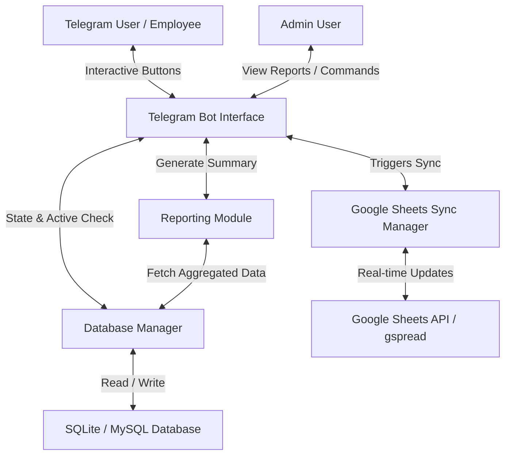

# Employee Attendance and Time Tracking System

A scalable, secure, and production-ready Employee Attendance and Time Tracking System built with **Python**, **Telegram Bot API (python-telegram-bot)**, and **SQLite/MySQL**, with real-time **Google Sheets API** synchronization using **gspread**.

---

## Folder Structure

Following clean architecture and OOP principles:

```text
/
├── .env.example                 # Environment variables configuration template
├── .gitignore                   # Files to ignore in Git version control
├── README.md                    # Technical documentation and guides
├── requirements.txt             # Project library dependencies
├── dbdiagram.io.txt             # DBML markup code for database visualization
├── schema.sql                   # SQL initialization scripts (tables and indexes)
├── main.py                      # Application bootstrap and daemon listener
├── config.py                    # Environment settings and credential parser
├── database/
│   ├── __init__.py              # Database module exports
│   ├── base.py                  # Abstract database client interface
│   └── sqlite_db.py             # SQLite driver implementation
├── google_sheets/
│   ├── __init__.py              # Sheets module exports
│   └── sheets_sync.py           # Real-time synchronization manager
├── bot/
│   ├── __init__.py              # Bot package exports
│   ├── handlers.py              # Telegram command and button routers
│   ├── keyboards.py             # ReplyKeyboardMarkup layout designs
│   ├── validation.py            # Workflow sequence and business validation engine
│   └── shifts.py                # Per-employee shift lookup (DB + hardcoded fallback)
├── reports/
│   ├── __init__.py              # Reports package exports
│   └── reporter.py              # Time differences and summaries calculator
├── dashboard/
│   ├── app.py                   # Flask admin dashboard (API + views)
│   ├── templates/index.html     # Dashboard single-page shell
│   └── static/                  # Dashboard CSS/JS
└── tests/
    ├── test_core.py             # Offline unit tests (validation, math, fines, keyboards)
    └── test_dashboard_smoke.py  # Flask dashboard smoke tests + auth gate tests
```

---

## System Architecture



### Core Flow
1. **Interactive Buttons**: The Telegram UI presents employees with persistent reply keyboard buttons for punching time.
2. **State & Validation**: Clicking a button queries the local database via the `AttendanceValidationEngine` to evaluate whether the requested punch action is valid.
3. **Database Operations**: If valid, the database is updated.
4. **Google Sheets Sync**: Real-time event signals are dispatched to update Google Sheets. The `Session ID` (from the DB auto-increment value) is used to map, target, and update matching spreadsheet rows.
5. **Reporting**: Employees and admins can pull reports computed from local data.

---

## Database Design

The database stores records in four structured tables. It is designed to be fully compatible with MySQL for future production deployments.

### dbdiagram.io Markup (DBML)
Paste this markup directly into [dbdiagram.io](https://dbdiagram.io) to generate visualization diagrams:
```dbml
Table users {
  telegram_id integer [primary key]
  username varchar
  full_name varchar
  role varchar
  registered_at timestamp
}

Table attendance_sessions {
  id integer [primary key, increment]
  telegram_id integer [ref: > users.telegram_id]
  username varchar
  name varchar
  date varchar
  login_time varchar
  logout_time varchar
  duration integer
  status varchar
}

Table break_sessions {
  id integer [primary key, increment]
  telegram_id integer [ref: > users.telegram_id]
  username varchar
  name varchar
  date varchar
  break_in_time varchar
  break_out_time varchar
  duration integer
  status varchar
}

Table in_out_sessions {
  id integer [primary key, increment]
  telegram_id integer [ref: > users.telegram_id]
  username varchar
  name varchar
  date varchar
  in_time varchar
  out_time varchar
  duration integer
  status varchar
}
```

---

## State Machine & Validation Engine

To prevent illegal actions (like logging out before logging in), the system implements a strict state validation engine based on active sessions in the database:

| Action | Prerequisites | DB Update on Success | Error Rejection |
| :--- | :--- | :--- | :--- |
| **Login** | No active attendance record today. | Creates new session in `attendance_sessions` with status `'active'`. | "You are already logged in!" |
| **Logout** | Active attendance session AND no active break AND no active field movement. | Sets `logout_time`, calculates total duration, status = `'completed'`. | "You must login first!" OR "Please end break/field movement before logging out." |
| **Break In** | Active attendance session AND no active break AND no active field movement. | Creates new session in `break_sessions` with status `'active'`. | "You must login first!" OR "Already on break!" OR "Cannot start break on field movement." |
| **Break Out**| Active break session. | Sets `break_out_time`, calculates break duration, status = `'completed'`. | "You are not currently on a break!" |
| **In** (Field visit) | Active attendance session AND no active break AND no active field movement. | Creates new session in `in_out_sessions` with status `'active'`. | "You must login first!" OR "Cannot start field visit on break!" OR "Already on field visit." |
| **Out** (Field end)| Active field session. | Sets `out_time`, calculates field duration, status = `'completed'`. | "You do not have an active field visit to end!" |

### Auto-Closing Leftover Sessions
If an employee fails to sign out, their active session remains open. When they trigger any punch event the next day, the system automatically detects this and closes the leftover yesterday sessions at `23:59:59` to maintain timecard accuracy.

---

## Google Sheets Synchronization

The system uses `gspread` to synchronize attendance events in real time. 
Three worksheets (tabs) are managed in a single spreadsheet:
1. **Attendance Sessions**
2. **Break Sessions**
3. **In-Out Sessions**

### Sheets Setup & Shared Access
1. Go to the [Google Cloud Console](https://console.cloud.google.com/).
2. Create a Project, enable the **Google Drive API** and **Google Sheets API**.
3. Create a **Service Account** and generate a credentials key in **JSON format**.
4. Create a Google Sheet and copy its **Spreadsheet ID** from the URL.
5. **CRITICAL STEP**: Share the Google Sheet with the Service Account email (e.g. `your-service-account@project-id.iam.gserviceaccount.com`) as an **Editor**.
6. Set the JSON content into `GOOGLE_CREDS_JSON` in your `.env` file (or save as `service_account.json` locally).

---

## Daily Reporting Module & Metrics

The system calculates times on-the-fly, including dynamic calculation for currently active sessions:

- **Total Login Duration** = Sum of duration of all attendance sessions for that employee today.
- **Total Break Duration** = Sum of duration of all break sessions for that employee today.
- **Total In-Out Duration** = Sum of duration of all movement sessions for that employee today.
- **Net Working Hours** = `Total Login Duration` - `Total Break Duration`.

All durations are converted from seconds to a clean `HH:MM:SS` format.

---

## Running Offline Unit Tests

An automated test suite verifies the state machine, duration math, auto-closing
of leftover sessions, fine/permission logic, and the dashboard API — all
against a throwaway temp database, never `attendance.db`, and with zero
network calls to Telegram or Google Sheets:

```bash
# From the project root directory
PYTHONPATH=. python3 -m unittest tests.test_core tests.test_dashboard_smoke -v
```
*(Tests output `OK` if validation constraints, duration arithmetic, leftover
auto-closing, and the dashboard API all work correctly.)*

---

## Dashboard Security

The dashboard (`dashboard/app.py`) exposes employee PII, fines, and admin
actions (ban, edit attendance, approve/reject requests) with **no other
access control**. Before hosting it anywhere reachable from outside your own
machine, set `DASHBOARD_USERNAME` and `DASHBOARD_PASSWORD` in your `.env` —
this gates every route behind HTTP Basic Auth. Leaving `DASHBOARD_PASSWORD`
blank disables auth entirely, which is only appropriate for local development
on a trusted machine.

---

## Deployment Guide (Render Hosting)

Render is a robust cloud platform suitable for running Python processes. Since the Telegram bot uses long-polling, it should be deployed as a **Background Worker** on Render.

### Prerequisites
1. Push your project to a GitHub repository (excluding virtual environments and `.env` files).
2. Set up your Google Sheets API credentials.

### Deploy Steps
1. Log in to [Render](https://render.com/).
2. Click **New +** and select **Background Worker**.
3. Link your GitHub repository.
4. Set the following details:
   - **Name**: `telegram-attendance-bot`
   - **Region**: Select closest to your users.
   - **Branch**: `main` or `master`
   - **Runtime**: `Python`
   - **Build Command**: `pip install -r requirements.txt`
   - **Start Command**: `python main.py`
5. Add a **persistent disk** (Render dashboards under the service's *Disks* tab), e.g. mounted at `/var/data`, and set `DB_PATH=/var/data/attendance.db`. Without a disk, SQLite writes are lost on every deploy/restart since Render's default filesystem is ephemeral.
6. Expand the **Advanced** section to add **Environment Variables**:
   - `TELEGRAM_BOT_TOKEN`: *Your Telegram Bot Token*
   - `ADMIN_TELEGRAM_IDS`: *Comma-separated Telegram IDs of system administrators*
   - `TIMEZONE`: *e.g., Asia/Kolkata*
   - `DB_PATH`: `/var/data/attendance.db` (matching the disk mount path above)
   - `GOOGLE_SPREADSHEET_ID`: *ID of your Google Sheet*
   - `GOOGLE_CREDS_JSON`: *Paste the entire content of your service_account.json here as a single string*
7. Click **Deploy Background Worker**. Render will build the image, start the database, connect to the sheet, and begin polling Telegram messages.

### Deploying the Dashboard

The dashboard is a separate Flask app and needs its own Render **Web Service**
(background workers don't get a public URL). The important constraint:
**Render persistent disks are not shared between services** — a Web Service
and a Background Worker each get their own private disk, so they cannot both
read/write the same `attendance.db` file if deployed as two separate Render
services.

Practical options, in order of effort:
1. **Simplest — keep the dashboard local.** Deploy only the bot (above) for 24/7 uptime, and keep running `python dashboard/app.py` on your own machine when you need to check the dashboard, pointed at a synced/copied `attendance.db`.
2. **One combined Render Web Service.** Run both the bot's polling loop and the Flask dashboard in a single process/service so they share one disk. This requires wiring the bot's `run_polling()` and `gunicorn` into one entrypoint — not implemented here, since it needs live Telegram verification before trusting it in production.
3. **Move off SQLite** to a hosted Postgres/MySQL database reachable from both services over the network. `database/base.py` is already an abstract interface designed for this, but it requires writing a new driver class — a larger change.

Whichever option you pick, always set `DASHBOARD_USERNAME` / `DASHBOARD_PASSWORD` (see *Dashboard Security* above) before making it reachable from outside your own machine. To run the dashboard under a production WSGI server instead of Flask's dev server:
```bash
gunicorn dashboard.app:app --bind 0.0.0.0:$PORT
```

### Cutover Runbook: Moving Off a Locally-Run Bot

If the bot currently runs on a local PC (as opposed to Render), moving it to
Render without downtime or duplicate-polling conflicts:
1. Deploy the Background Worker on Render **first**, but do not stop the local PC's bot yet. Render will fail to `getUpdates` with 409 Conflict errors while the local instance is still polling — that's expected and harmless.
2. Confirm the Render deploy is healthy (check logs for `Bot is polling for messages`) and the new deploy's Google Sheets sync + DB migrations look correct.
3. Copy the local PC's `attendance.db` to Render's persistent disk (or accept a small gap and let Render start from the local copy at the moment of cutover) so historical data carries over.
4. Stop the bot process on the local PC.
5. Watch Render's logs for a few punches to confirm employees can log in/out normally with no conflicts.
6. Decommission the local PC's copy once you're confident the cloud instance is stable.
